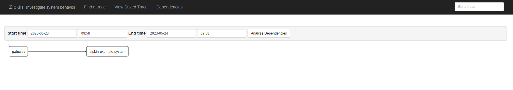

## Zipkin PostgresSQL

> 由于Zipkin不支持Postgres在网上也找了很久，最终发现[https://github.com/tian-junwei/zipkin-storage-postgresql](https://github.com/tian-junwei/zipkin-storage-postgresql) 可以实现 ,并对起进行二次开发和整合

### 项目结构

```
├───doc
│   └───sql                         zikin初始化sql
├───zipkin-admin-server             zipkin-server 默认登录用户:yanghaiji 密码654321
├───zipkin-example                  集成示例
│   ├───zipkin-example-gateway      api gateway
│   └───zipkin-example-system       示例业务服务
└───zipkin-storage-postgresql       zipkin持久化驱动

```

### zipkin-storage-postgresql

由于打包有license的问题，大家可以执行一下命令

```shell script
mvn clean  com.mycila:license-maven-plugin:format install -DskipTests  -Denforcer.skip=true 
```


### zipkin-server

[登录: http://localhost:9411/](http://localhost:9411/)

> username: yanghaiji
>
> password: 654321


访问测试路径[http://localhost:9412/system/api/test/user](http://localhost:9412/system/api/test/user)

- zipkin 首页


- traces


- dependency



